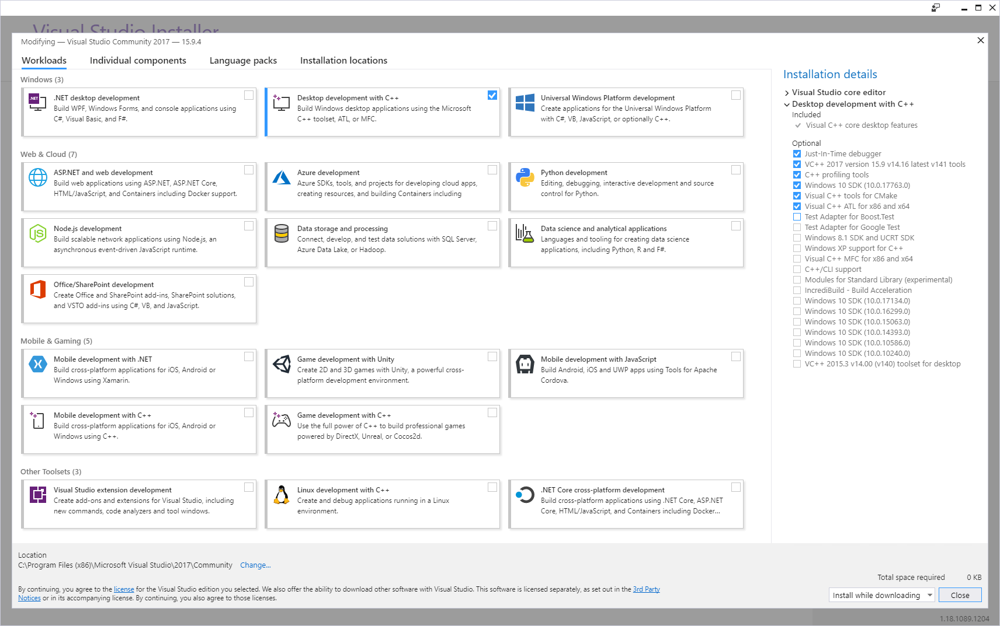
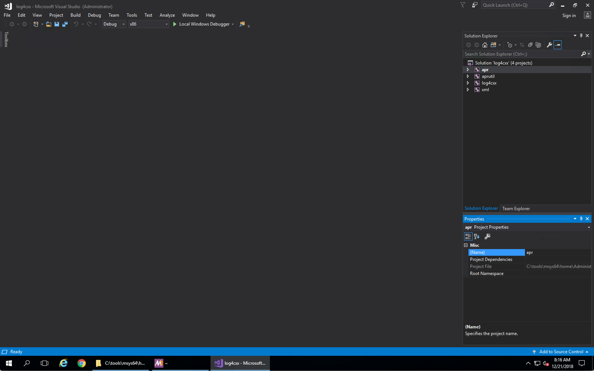
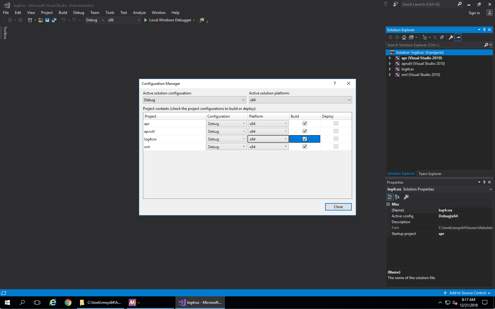
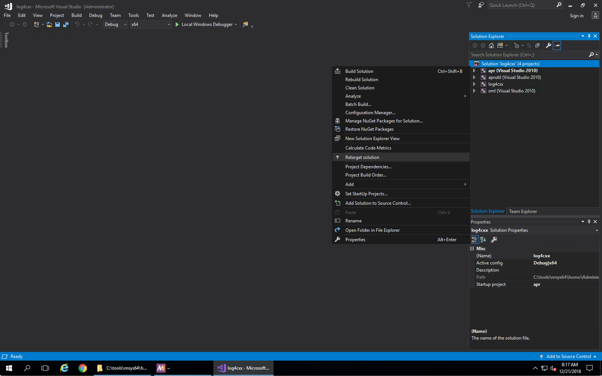

Chocolatey Package for Log4cxx.

This package is beta quality and designed for a specific application.
At this time it is not recommended to distribute this package outside of the
tutorial application which requires it.

To build the package, follow these steps.

You need Git, Visual Studio 2017 Command line tools, CMake, Chocolatey, and a text editor.

# building on Windows Server 2016

## refs

* https://github.com/aescande/log4cxxWin32

## APR

* [apr 1.5.2](http://archive.apache.org/dist/apr/apr-1.5.2-win32-src.zip)
* [apt-util 1.5.4](http://archive.apache.org/dist/apr/apr-util-1.5.4-win32-src.zip)

## log4cxx

* [apache-log4cxx 0.10.0](https://archive.apache.org/dist/logging/log4cxx/0.10.0/apache-log4cxx-0.10.0.zip)

## steps

### install Visual Studio 2017

https://visualstudio.microsoft.com/downloads/

Make sure you have the Windows SDK selected when installing VisualStudio.

Something like this:

### install msys2 and some tools

Technically this is optional but it's handy to have the Unix shell experience when applying the patches.

    choco install -y msys2

In msys2 shell:

    pacman -S msys/unzip

### fetch code and apply patches

    wget http://archive.apache.org/dist/apr/apr-1.5.2-win32-src.zip
    wget http://archive.apache.org/dist/apr/apr-util-1.5.4-win32-src.zip
    wget https://archive.apache.org/dist/logging/log4cxx/0.10.0/apache-log4cxx-0.10.0.zip

    unzip apr-1.5.2-win32-src.zip > /dev/null 2>&1
    unzip apr-util-1.5.4-win32-src.zip > /dev/null 2>&1
    unzip apache-log4cxx-0.10.0.zip > /dev/null 2>&1

    mkdir ap
    mv apr-1.5.2 ap/apr
    mv apr-util-1.5.4 ap/apr-util
    mv apache-log4cxx-0.10.0 ap/log4cxx

    cd ap/log4cxx
    ./configure-aprutil.bat
    ./configure.bat

    sed -i "/#include <vector>/ a #include<iterator>" ../log4cxx/src/main/cpp/stringhelper.cpp
    sed -i "/namespace log4cxx/ i #define DELETED_CTORS(T) T(const T&) = delete; T& operator=(const T&) = delete;\n\n#define DEFAULTED_AND_DELETED_CTORS(T) T() = default; T(const T&) = delete; T& operator=(const T&) = delete;\n" ../log4cxx/src/main/include/log4cxx/helpers/objectimpl.h
    sed -i "/END_LOG4CXX_CAST_MAP()/ a \  DEFAULTED_AND_DELETED_CTORS(PatternConverter)" ../log4cxx/src/main/include/log4cxx/pattern/patternconverter.h
    sed -i "/virtual ~RollingPolicyBase();/ i \          DELETED_CTORS(RollingPolicyBase)" ../log4cxx/src/main/include/log4cxx/rolling/RollingPolicyBase.h
    sed -i "/virtual ~TriggeringPolicy();/ i \             DEFAULTED_AND_DELETED_CTORS(TriggeringPolicy)" ../log4cxx/src/main/include/log4cxx/rolling/TriggeringPolicy.h
    sed -i "/Filter();/ a \                        DELETED_CTORS(Filter)" ../log4cxx/src/main/include/log4cxx/spi/Filter.h
    sed -i "/virtual ~Layout();/ i \                DEFAULTED_AND_DELETED_CTORS(Layout)" ../log4cxx/src/main/include/log4cxx/Layout.h
    sed -i -e "s/defined(_MSC_VER) \&\&/defined(_MSC_VER) \&\& _MSC_VER < 1600 \&\&/" ../log4cxx/src/main/include/log4cxx/log4cxx.h

### build in VisualStudio

#### open log4cxx.dsw

Double-click `log4cxx.dsw` to open the project in VisualStudio.

#### set the right platform

Right-click solution, then click "Configuration Manager..."

The following is a demo of using x64 instead of x86. Your use case may differ.

#### retarget solution

Right-click solution, then click "Retarget solution..."

Select the correct `Windows SDK Version` and click `OK`.

#### additional lib

To fix a potential build issue, add `rpcrt4.lib` as `Additional Dependency`.

#### build

Right-click log4cxx, then click build

### create nupack

- Copy log4cxxd.lib and log4cxx.dll to the package lib/ directory.
- Find the debug symbols (a .pdb file) in the build directory and copy it to the package lib/ directory. I have to use File Explorer's search to find it.
- Copy *.h from the log4cxx source directory to the package include/ directory.
- Verify the information in the package share/cmake/ directory and nuspec.
- Run `choco pack`.
- Test the package and if it's good upload it somewhere your end users can reach it.
